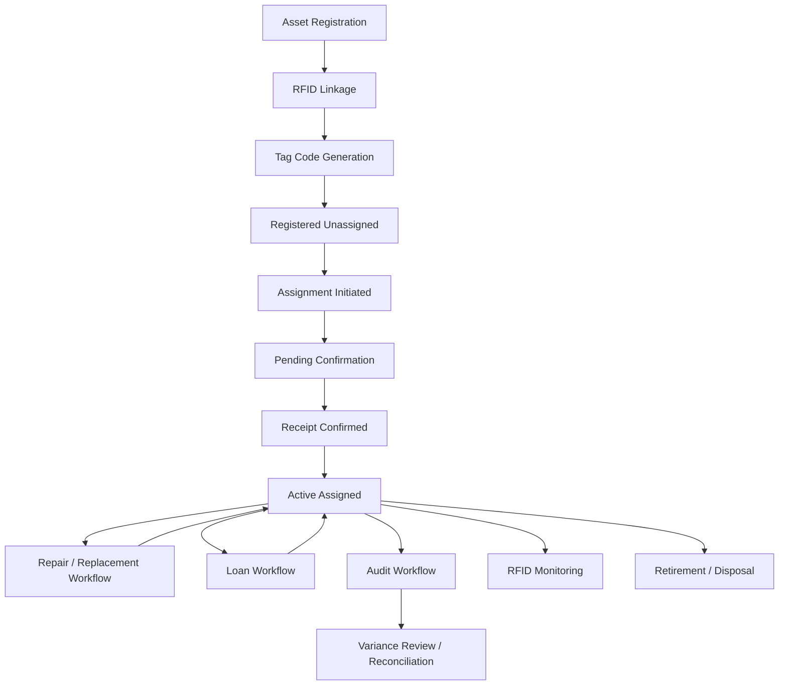
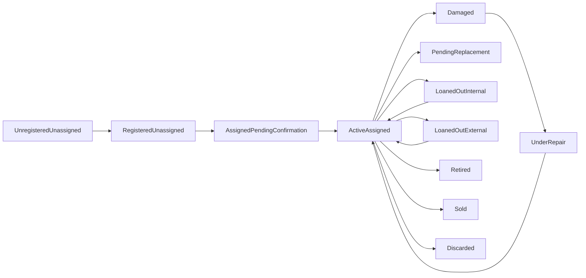
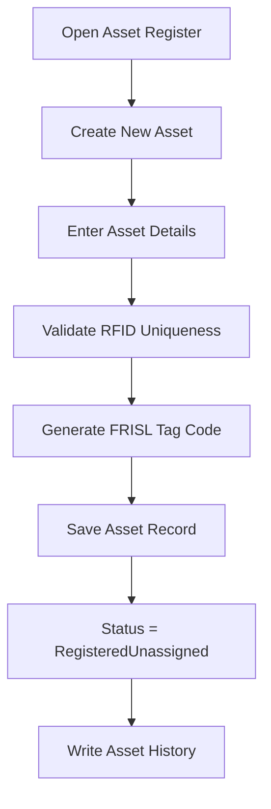
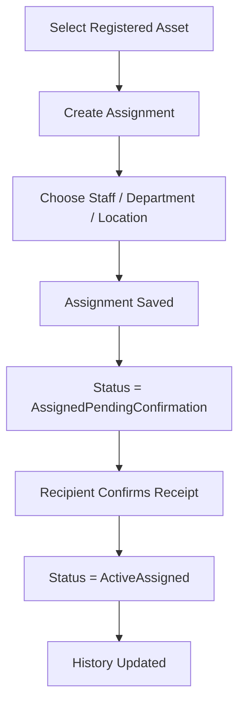
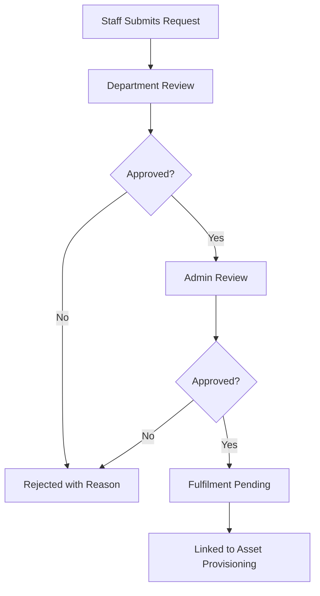
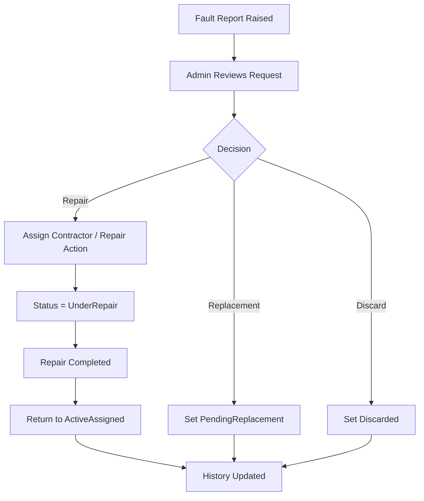
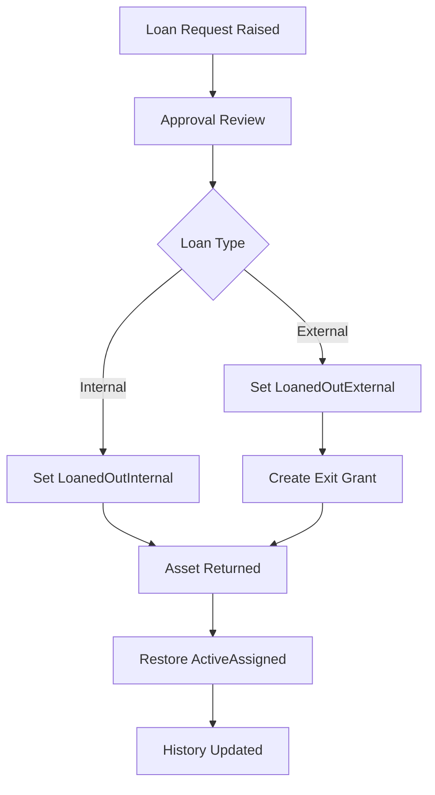
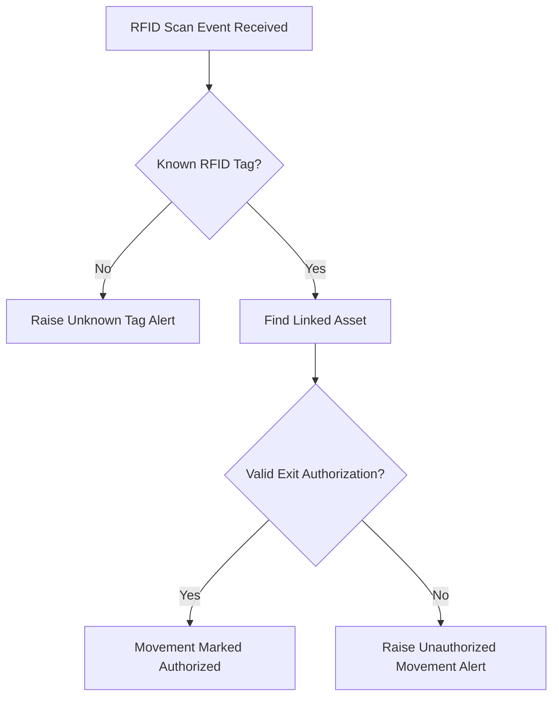
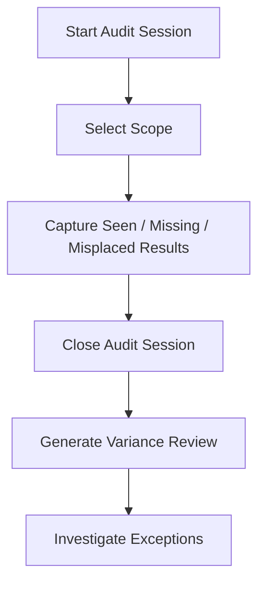

# FRISL Enterprise Asset Management System
## Application Workflow Document

## Purpose
This document explains how the FRISL Enterprise Asset Management System (EAMS) works in practice from a workflow point of view.

It is designed to help:
- client stakeholders understand the business flow
- trainers explain the application clearly
- administrators follow the intended lifecycle of assets
- project teams align on how the modules connect

## Workflow Overview
The application is built around one central business idea:

`an asset moves through controlled lifecycle stages, and every important action is recorded`

The workflow starts when an asset is registered and can continue through:
- assignment
- receipt confirmation
- repair
- replacement
- loan
- RFID movement checks
- audit
- reporting
- retirement or disposal

## High-Level Workflow

## Core Lifecycle Workflow
The normal lifecycle of an asset follows this pattern:

1. Asset details are captured by an administrator.
2. The system validates the RFID code to ensure uniqueness.
3. The system generates an official FRISL asset tag.
4. The asset enters `RegisteredUnassigned` status.
5. An assignment is created for a user, department, and location.
6. The asset enters `AssignedPendingConfirmation`.
7. The receiving user confirms receipt.
8. The asset becomes `ActiveAssigned`.
9. Later actions such as repair, loan, audit, or disposal update the asset through controlled transitions.
10. Each transition is written into the asset history.

## Lifecycle Status Flow

## Module Workflows

### 1. Dashboard Workflow
The dashboard is the entry point after login.

Users typically:
1. log in
2. land on the dashboard
3. review summary counts and key operational indicators
4. drill into the relevant module for action

The dashboard supports monitoring rather than transaction processing.

### 2. Asset Registration Workflow
This workflow creates the official asset record.

Key outputs:
- a unique asset record
- a generated FRISL tag code
- a valid RFID linkage
- an auditable history entry

### 3. Assignment Workflow
This workflow handles custody transfer.

Business rule:
- an asset is not treated as fully assigned until the recipient confirms receipt

### 4. Asset Request Workflow
This workflow supports demand for new or replacement assets.

Typical use cases:
- request for a new asset
- request for a replacement asset

### 5. Repairs and Replacement Workflow
This workflow manages damaged or faulty assets.

Key control point:
- the workflow records whether the asset is repaired, replaced, or discarded

### 6. Loan Workflow
This workflow controls temporary movement outside normal custody.

Important business rule:
- external loans trigger an exit grant automatically

### 7. RFID Monitoring Workflow
This workflow checks whether asset movement is authorized.

Current scope note:
- the application logic exists, but live hardware integration is still a future phase

### 8. Audit Workflow
This workflow supports stock-taking and variance checks.

Outputs:
- audit session record
- audit results
- variance analysis for follow-up

### 9. Reporting Workflow
This workflow provides management and operational visibility.

Users typically:
1. open the reports module
2. choose the report type
3. apply filters
4. review the result on screen
5. export to CSV where needed

Current report types:
- asset report
- depreciation report
- aging report

### 10. Staff and Contractor Workflow
This workflow maintains operational reference data.

Users can:
- create and manage staff records
- create and manage repair contractor records
- activate or deactivate contractors

This data supports:
- assignments
- repair workflows
- approvals and operational routing

## End-to-End Operational Story
A practical end-to-end business story looks like this:

1. Admin registers a new laptop.
2. The system validates the RFID tag and generates the FRISL tag code.
3. The laptop becomes available for assignment.
4. Admin assigns the laptop to a staff member in a department and location.
5. The staff member confirms receipt.
6. The laptop becomes actively assigned.
7. Later, the laptop develops a fault and a repair request is raised.
8. Admin approves repair and assigns a contractor.
9. The asset moves into `UnderRepair`.
10. After completion, the asset returns to active service.
11. If the laptop is moved out temporarily, a loan process is raised.
12. If it passes an RFID checkpoint, the system checks whether that movement is authorized.
13. During an audit session, the same asset is verified and any variance is recorded.
14. Management can later see the asset in reports together with status, value, and age.

## Roles in the Workflow
### Admin
- registers assets
- initiates assignments
- approves operational actions
- controls repair, replacement, loan, and lifecycle actions

### Staff
- receives assigned assets
- confirms receipt
- raises requests and workflow submissions

### Auditor
- starts and manages audit activities
- records audit outcomes
- reviews variances

### Viewer
- reviews available data in read-only mode

## Control Principles
The workflow is built on these control principles:
- assets move through defined statuses, not ad hoc changes
- assignment requires confirmation
- repairs and loans require formal workflow actions
- RFID movement is checked against authorization
- history is preserved for accountability
- reports draw from operational records for management review

## Current Workflow Strengths
The current application already demonstrates:
- structured lifecycle control
- accountable assignment processing
- auditable status history
- controlled repair and loan workflows
- RFID alert logic
- audit session tracking
- management reporting support

## Current Workflow Gaps Before Production
For production maturity, the workflow still needs:
- enterprise authentication and authorization
- stronger notifications and escalation handling
- physical RFID device integration
- fuller procurement-to-fulfilment linkage
- stronger testing and deployment readiness
- production-grade database and operational controls

## Recommended Demo Sequence
For training or stakeholder presentation, use this workflow order:

1. Show the dashboard.
2. Register an asset.
3. Explain RFID and tag generation.
4. Create an assignment.
5. Confirm receipt.
6. Show active asset details and history.
7. Raise a repair request.
8. Show loan approval and exit grant logic.
9. Show RFID monitoring behavior.
10. Start an audit session and review variance output.
11. Open reports and export CSV.

## Summary
The FRISL EAMS workflow is a controlled asset lifecycle process.

The application connects registration, assignment, repair, loan, RFID monitoring, audit, and reporting into one operating flow. Its main strength is that every meaningful asset action is structured, reviewable, and traceable.
